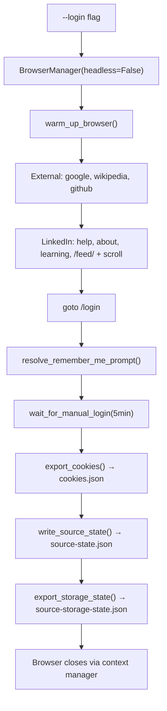
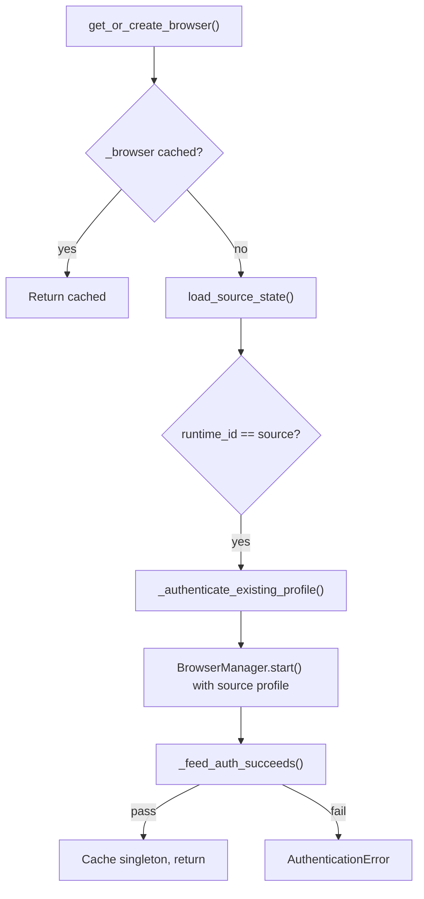
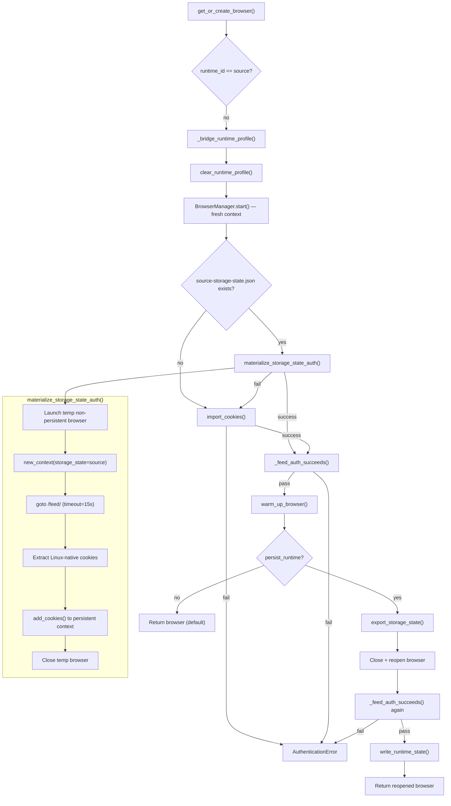
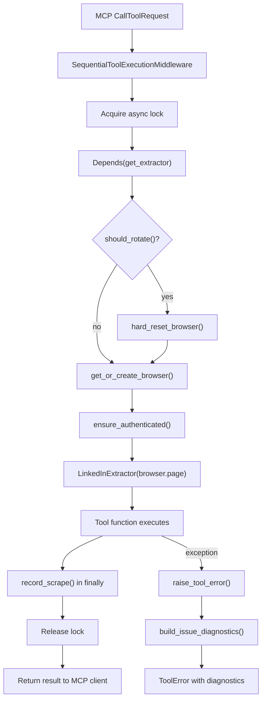
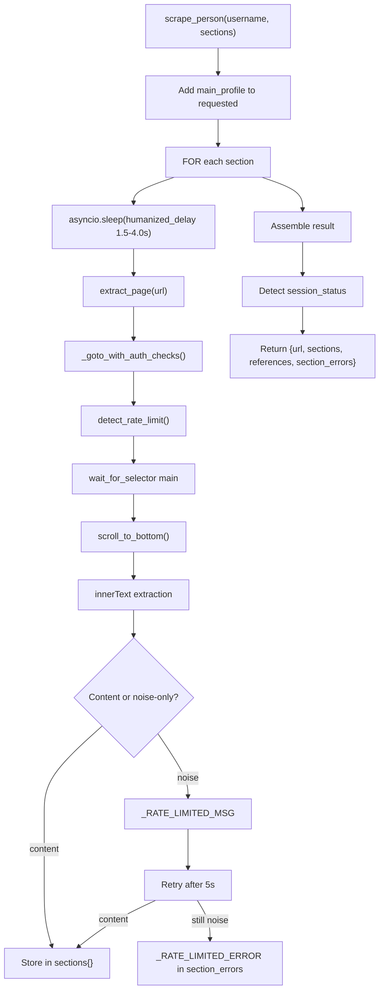
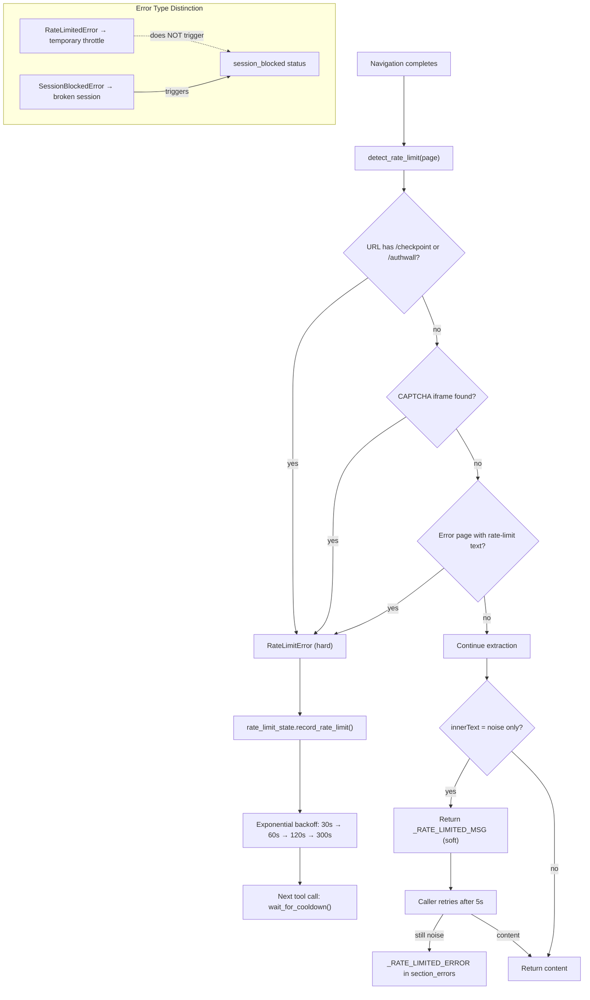
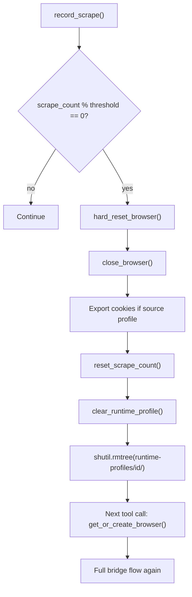
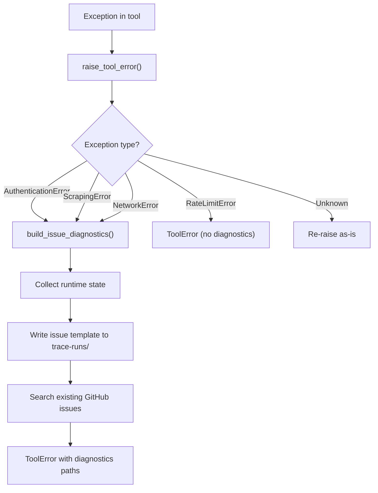
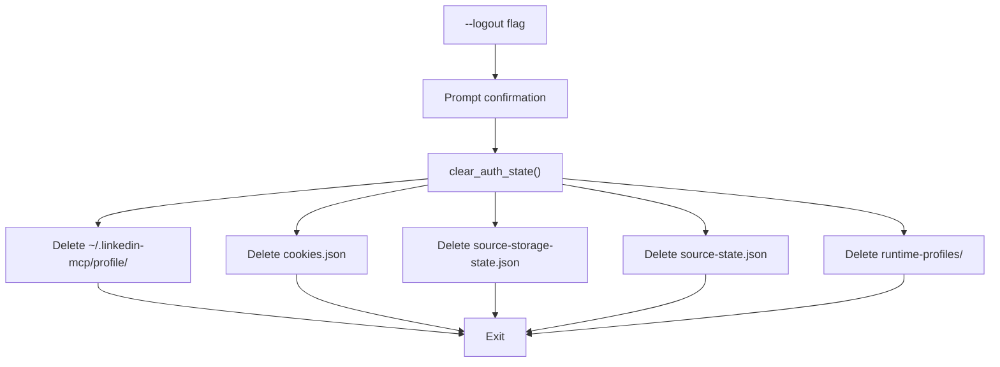

<!-- DEV-COUNCIL-MANAGED — created by /council-init. Do not edit manually. -->
# Project Flows

<!-- Updated via /council-flow. Consulted by Dev Council peers. -->

## 1. Interactive Login

**Type:** user flow
**Last updated:** 2026-03-20

### Diagram



### Steps

1. CLI detects `--login` — `cli_main.py:334`
2. Launch non-headless browser — `setup.py:53`
3. Warm-up: external sites + LinkedIn public pages + feed scroll — `core/auth.py:37-81`
4. Navigate to `/login` — `setup.py:60`
5. Auto-resolve remember-me prompt — `core/auth.py:200-264`
6. Wait for manual login (5min timeout, 2FA, CAPTCHA) — `core/auth.py:280-318`
7. Export portable cookies — `core/browser.py:175-194` → `~/.linkedin-mcp/cookies.json`
8. Write source state metadata — `session_state.py:216-230` → `~/.linkedin-mcp/source-state.json`
9. Export storage state — `core/browser.py:196-219` → `~/.linkedin-mcp/source-storage-state.json`

---

## 2. Local Authentication (Same Runtime)

**Type:** data flow
**Last updated:** 2026-03-20

### Diagram



### Steps

1. Check singleton cache — `drivers/browser.py:382-383`
2. Load source state + validate profile exists — `drivers/browser.py:386-397`
3. Compare `get_runtime_id()` with `source_state.source_runtime_id` — `drivers/browser.py:401`
4. Launch persistent browser with source profile — `drivers/browser.py:231-233`
5. Validate feed loads authenticated — `drivers/browser.py:128-192`
6. Cache and return — `drivers/browser.py:412-415`

---

## 3. Docker Cookie Bridge (Foreign Runtime)

**Type:** data flow
**Last updated:** 2026-03-20

### Diagram



### Steps

1. Runtime mismatch detected — `drivers/browser.py:401`
2. Clear previous derived profile — `session_state.py:280-292`
3. Start fresh browser at `about:blank` (no pre-import navigation) — `drivers/browser.py:266-271`
4. Try `materialize_storage_state_auth()` — temp context warms cookies — `core/browser.py:259-345`
5. Fallback to `import_cookies()` if materialize fails — `core/browser.py:396-451`
6. Validate feed authenticated — `drivers/browser.py:288`
7. Warm-up: external + LinkedIn public pages + feed scroll — `drivers/browser.py:294`
8. Return browser (default: no persistence) — `drivers/browser.py:295-302`

### Notes

- No navigation before cookie injection — pre-import goto poisons bcookie/JSESSIONID
- Temp context in materialize uses `storage_state=` param for full state hydration
- Warm-up happens AFTER feed validation to avoid context poisoning
- `persist_runtime=True` requires `LINKEDIN_EXPERIMENTAL_PERSIST_DERIVED_SESSION=1`

---

## 4. MCP Tool Call

**Type:** API flow
**Last updated:** 2026-03-20

### Diagram



### Steps

1. FastMCP receives request — routed to tool function
2. `SequentialToolExecutionMiddleware` serializes execution — `sequential_tool_middleware.py:39-73`
3. `get_extractor()` dependency — `dependencies.py:20-44`
4. Check context rotation threshold — `drivers/browser.py:568-571`
5. Get/create browser (auth if needed) — `drivers/browser.py:359-501`
6. Ensure authenticated — `drivers/browser.py:612-620`
7. Create extractor, yield to tool — `dependencies.py:38`
8. Tool executes scraping logic
9. `record_scrape()` increments counter — `drivers/browser.py:562-565`
10. Exception → `raise_tool_error()` → `ToolError` with diagnostics — `error_handler.py:54-144`

---

## 5. Person Profile Scraping

**Type:** data flow
**Last updated:** 2026-03-20

### Diagram



### Steps

1. Parse requested sections, always include `main_profile` — `extractor.py:592`
2. For each section in `PERSON_SECTIONS` — `scraping/fields.py`
3. Humanized delay between navigations — `core/utils.py:19-21`
4. Navigate with auth checks — `extractor.py:261-376`
5. Detect hard rate limits (URL, CAPTCHA, error page) — `core/utils.py:73-146`
6. Wait for `<main>` element — `extractor.py:433`
7. Scroll to load lazy content — `core/utils.py:148-168`
8. Extract innerText, strip LinkedIn noise — `extractor.py:478-520`
9. Soft rate limit: noise-only → retry after 5s — `extractor.py:399-405`
10. Assemble result with session_status detection — `extractor.py:639-659`

---

## 6. Rate Limit Handling

**Type:** data flow
**Last updated:** 2026-03-20

### Diagram



### Notes

- Hard rate limits raise `RateLimitError` immediately — `core/utils.py:73-146`
- Soft rate limits (noise-only pages) retry once with 5s backoff — `extractor.py:399-405`
- `RateLimitedError` is distinct from `SessionBlockedError` — rate limits do NOT trigger `session_blocked`
- Exponential backoff: 30s, 60s, 120s, 300s cap — `core/utils.py:24-40`
- Cooldown enforced before each scraping operation — `core/utils.py:65-70`

---

## 7. Context Rotation & Hard Reset

**Type:** data flow
**Last updated:** 2026-03-20

### Diagram



### Steps

1. Each tool call increments `_scrape_count` — `drivers/browser.py:562-565`
2. `should_rotate()` checks threshold (default: 3) — `drivers/browser.py:568-571`
3. `hard_reset_browser()` closes browser + wipes derived profile — `drivers/browser.py:527-547`
4. Next call triggers full re-bridge from source cookies

---

## 8. Error Diagnostics

**Type:** data flow
**Last updated:** 2026-03-20

### Diagram



### Notes

- Every diagnostics-eligible exception writes an issue-ready markdown report — `error_diagnostics.py:32-94`
- Reports include: runtime_id, source_state, trace artifacts, server log, suggested gist command
- `RateLimitError` and `ProfileNotFoundError` skip diagnostics (standard handling)
- Unknown exceptions re-raise to let FastMCP's `mask_error_details=true` handle them

---

## 9. Logout

**Type:** user flow
**Last updated:** 2026-03-20

### Diagram



### Steps

1. CLI detects `--logout` — `cli_main.py:328-330`
2. Confirm with user — `cli_main.py:84-104`
3. `clear_auth_state()` deletes all auth artifacts — `session_state.py:295-318`
4. Exit

---

## File Structure

```
~/.linkedin-mcp/
├── profile/                        ← source browser profile (Chromium persistent context)
├── cookies.json                    ← portable cookie export (bridge source)
├── source-storage-state.json       ← full storage state snapshot (materialize source)
├── source-state.json               ← session metadata (runtime_id, login_generation)
├── runtime-profiles/               ← derived sessions per runtime
│   └── linux-arm64-container/
│       ├── profile/                ← derived browser profile
│       ├── storage-state.json      ← checkpoint snapshot
│       └── runtime-state.json      ← derived metadata
└── trace-runs/                     ← debug traces + issue reports
    └── run-{id}/
        ├── trace.jsonl
        ├── server.log
        ├── screens/
        └── {timestamp}-{context}.md
```
